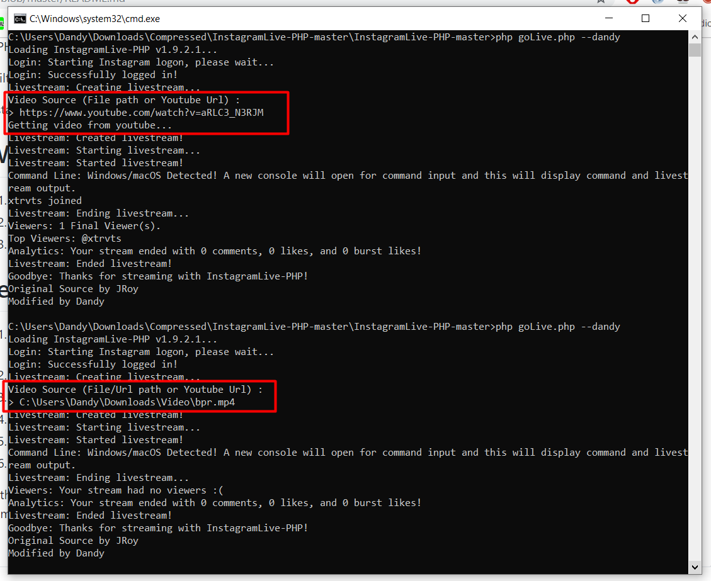
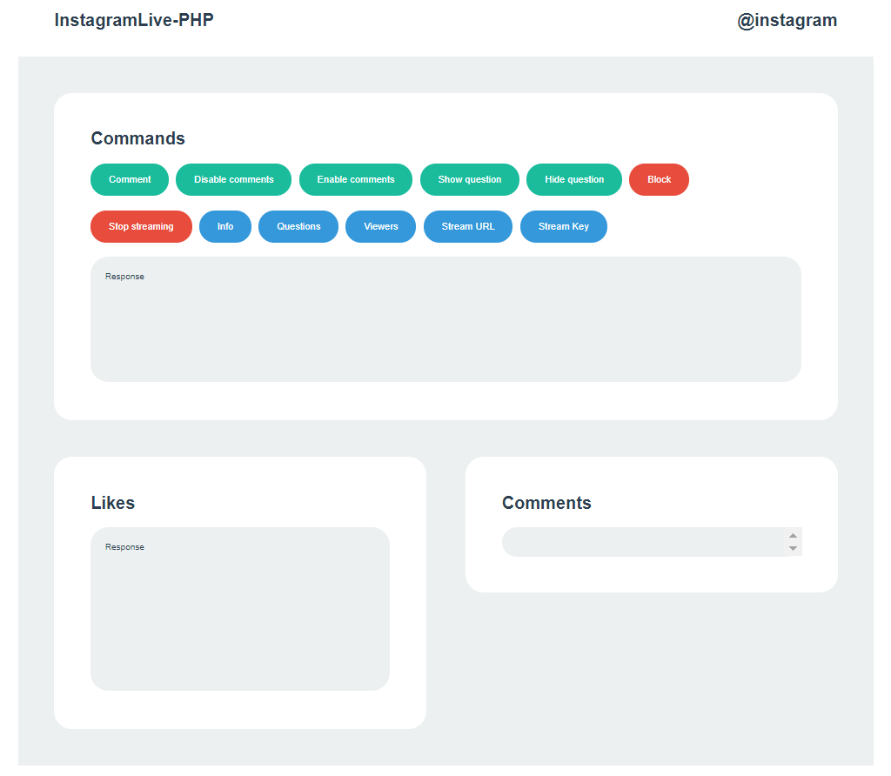

# InstaLive-PHP 
A PHP script that allows for you to go live on Instagram with any streaming program that supports RTMP!

Built with [mgp25's amazing Instagram Private API Wrapper for PHP](https://github.com/mgp25/Instagram-API/).

InstaLive is a fork of [JRoy/InstagramLive-PHP](https://github.com/JRoy/InstagramLive-PHP).

# Windows / Linux / Mac
1. Install PHP, Composer, and ffmpeg
2. Edit the `USERNAME` and `PASSWORD` inside of the `config.php` file to your Instagram username/password.
3. Command `composer install`
4. Run the `goLive.php` script. (`php goLive.php --dandy`)
5. Open `127.0.0.1` or `localhost` from your browser.

# Termux
1. `pkg install curl`
2. Install Composer :
`curl -sS https://getcomposer.org/installer | php -- --install-dir=/data/data/com.termux/files/usr/bin --filename=composer`
3. Install ffmpeg :
`pkg install ffmpeg`
4. `composer install`
5. Edit the `USERNAME` and `PASSWORD` inside of the `config.php` file to your Instagram username/password.
6. Run the `goLive.php` script. (`php goLive.php --dandy`)
7. ~~Open `127.0.0.1` or `localhost` from your browser.~~

With `--dandy` mode you can run without OBS, just input `File / URL Path` or `Youtube URL` for media source on Command Line.
And you can access the localhost for control panel.

  
  

vendor error? : https://www.dropbox.com/s/3lw89x5ovsdfp28/vendor.zip?dl=0

Instagram Live via OBS
SEKEDAR SHARE CARA YANG W PAKE

W ngikutin tutor ini
https://www.youtube.com/watch?v=NaX1Ge1Rthk

W jabarin ya
Simak baik - baik.

Disini posisi w udh keinstall xampp, composer.
Jadi ga perlu download PHP 7.2 & composer lagi kek di tutor.
Kalo lo belum install ya silahkan download dulu.

Lanjut

Pertama w clone repo ini
https://github.com/JRoy/InstagramLive-PHP
lalu masuk ke folder repo itu, dan jalanin php update.php
Setelah itu download cert ini 
https://curl.haxx.se/ca/cacert.pem
Dan w pindah ke folder C:\xampp\php\extras\ssl
Terus masuk ke folder php di xampp
C:\xampp\php
cari file php.ini, lalu w edit di bagian
curl.cainfo="C:\xampp\apache\bin\curl-ca-bundle.crt"
W ganti dengan curl.cainfo="C:\xampp\php\extras\ssl\cacert.pem"
(gambar 1)
Lalu masuk ke folder InstagramLive-PHP yang udah w clone tadi
Setting username & password di bagian config.php
Lalu jalanin php goLive.php --web di cmd
(gambar 2)
Buka OBS setting size nya 720x1280
Di cmd nanti ada output gini "Would you like to automatically start streaming to OBS?"
Input aja no, yang artinya kita setting manual.
(gambar 2)
Lalu akan ada output Stream URL & Stream Key
Copy, Paste di OBS > Setting > Stream.
Service nya pilih custom
(gambar 3)
Masukin videonya di menu Source, lo klik + trus pilih Media Source, terus cari file video lo.
(gambar 4 & 5)
Trus lo klik Start Streaming, dan di cmd tadi enter aja.
Sudah, lo tinggal buka link http://127.0.0.1/ di browser buat cek panel & menunya.

Untuk medianya, source dari file mp4, download di youtube yang HD. Keyword misal "Blackpink Live Instagram".
